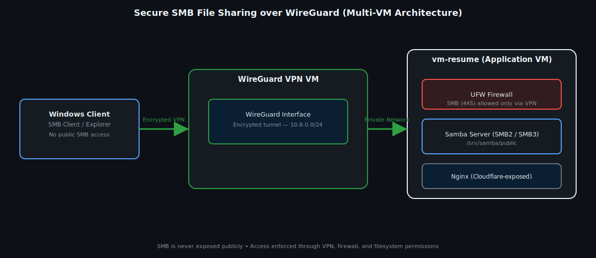
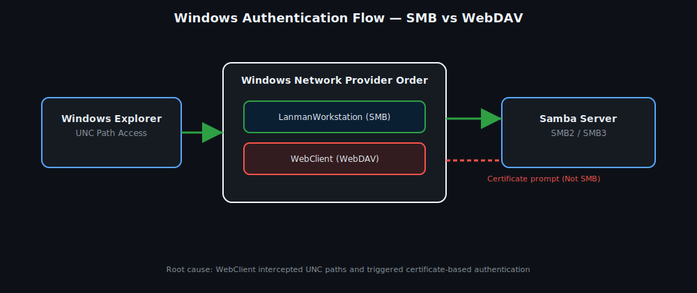
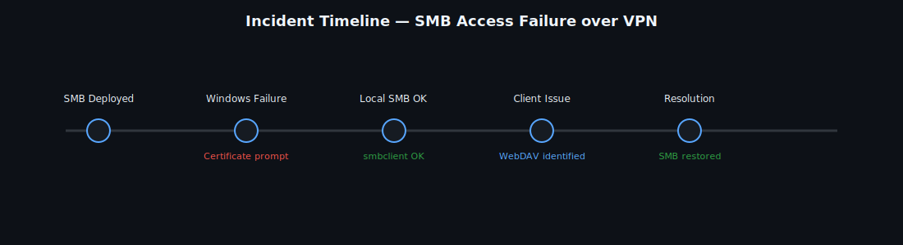
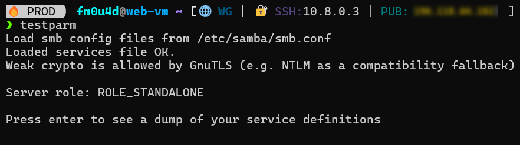
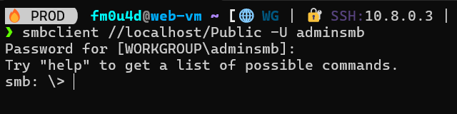
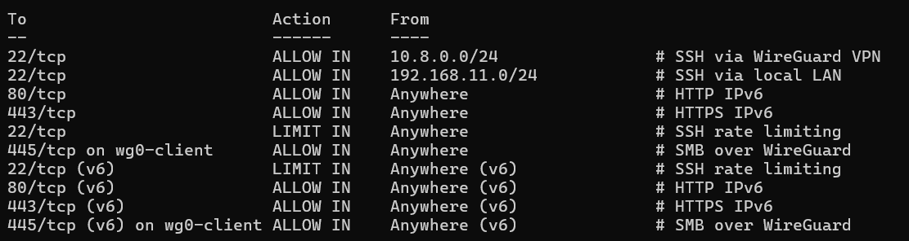
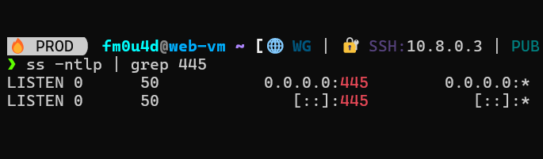
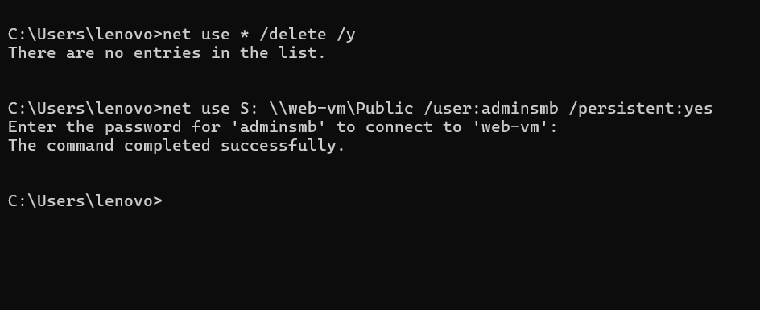
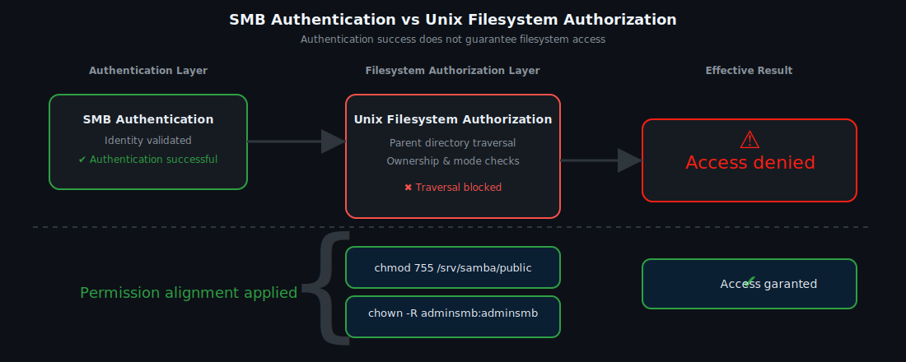

# Secure SMB over WireGuard — A Layered Failure Case Study 


A practical, incident-driven case study showing how an SMB share can appear correctly configured yet fail in real conditions — because **VPN transport**, **Windows policy / protocol / provider behavior**, **Samba auth**, and **Linux filesystem traversal** are separate gates.

This repo is designed to be:
- **VPN-only** (SMB not exposed publicly)
- **Reproducible** (portable pack + clear steps)
- **Self-validating** (scripts that prove each layer)

<br>


> **Reader guide**
> - ⏱️ **Short on time?** Read: *What you get* → *Architecture & Trust Boundaries* → *The incident* → *Success indicators*
> - 🔍 **Technical deep dive?** Continue with *Notes* and *Troubleshooting playbook*
> - 🧪 **Hands-on?** Jump to *Quickstart (10 minutes)* and *One-command demo mode*

<br>

## What you get

- A VPN-only SMB design (WireGuard-enforced boundary)
- A real failure that “changed shape” across layers:
  - Windows client policy / protocol / provider behavior interfered first
  - Linux permissions blocked traversal next (auth succeeded, access still failed)
- A clean **runbook**: detect → isolate → mitigate → verify
- Scripts you can reuse in any lab

> **Audience note**
>  
> This repository is designed for:
> - learners reproducing the lab step-by-step  
> - practitioners extending it with CI-based validation  
>  
> If you only want to understand and reproduce the case study,  
> **ignore the CI sections entirely**.

---

## Architecture & Trust Boundries


**Windows client → WireGuard → SMB server (Samba)**  
**Port 445** must be reachable **only** through the VPN boundary.

Key intent:
- SMB is **not** exposed on WAN/public NIC.
- Firewall rules are **interface-aware** (VPN interface/subnet allowed; public blocked).
- Samba authentication is not the end — **filesystem traversal** determines real access.

---

## The incident (what broke)




### Symptom
`Access to \\web-vm\Public fails from Windows clients` (or inconsistent behavior between `\\web-vm\Public` and `\\10.8.0.3\Public`)

### False signal
Credentials were accepted and a mapping could succeed, yet Explorer access failed or behaved strangely.

### Noise (not root cause)
A certificate prompt appeared (often caused by WebDAV/WebClient/provider noise), which distracted from the actual blocking layer.

### Twist (real root cause)
The failure was layered:
1) **Windows policy / protocol / provider choices** interfered before SMB behaved normally  
2) **Linux permissions blocked traversal** even when SMB auth was successful  
   - missing execute bit (`x`) on parent directories
   - ownership/mode alignment not matching intended access model

---
## Repo layout

```txt
pack/
├─ README.md  (this file)
├─ diagram/   (optional: SVG diagrams used in the case study page)
├─ proof/     (optional: screenshots used as evidence)
├─ server/
│  ├─ smb.conf.sanitized
│  ├─ validate.sh
│  ├─ apply-perms.sh
│  └─ snapshot.sh
└─ windows/
   ├─ map-drive.ps1
   ├─ disable-webclient.ps1
   ├─ reset-smb.ps1
   └─ policy-check.ps1
```

## Requirements

### SMB Server (Linux VM)
- Ubuntu/Debian (recommended)
- `sudo` access
- Packages:
  - `samba`
  - `smbclient`
  - `ufw`
- A working VPN boundary (WireGuard interface up **or** reachable VPN subnet already **routed**)
- Intended share paths (example):
  - `/srv/samba/public`
  - `/srv/samba/direction`

### Windows Client
- WireGuard client connected to the VPN (has an IP in your VPN subnet)
- PowerShell (Windows 10/11)
- Ability to run scripts (`ExecutionPolicy Bypass` is used in commands below)

---

## Setup variables (standardize these)

Pick values and keep them consistent across scripts + docs:

- **VPN subnet**: `10.8.0.0/24` (example)
- **SMB server VPN IP**: `10.8.0.3` (example)
- **Server hostname**: `web-vm` (optional, if you use name resolution)
- **Shares**: `Public`, `Direction`
- **SMB user**: `adminsmb` (example)

> Tip: when debugging, test both:
> - `\\10.8.0.3\Public` (direct)
> - `\\web-vm\Public` (adds name-resolution/provider layers)

### Optional: hostname resolution (Windows)

If you prefer accessing the share by hostname instead of raw IP (e.g. `\\web-vm\Public`), define a static mapping on the Windows client.

Edit the file:

**C:\Windows\System32\drivers\etc\hosts**

Add the SMB server VPN IP and hostname:

```text
10.8.0.2  web-vm
```


## Quickstart (10 minutes)
### Folder structure expected

```text
pack/
├─ server/
│       ├─ smb.conf.sanitized
│       └─ validate.sh
└─ windows/
        ├─ map-drive.ps1
        ├─ reset-smb.ps1
        ├─ disable-webclient.ps1
        └─ policy-check.ps1
```

### 1) On the SMB server (Linux VM)

> If your repo root already contains `server/` and `windows/`, run commands from the repo root.

---

### 1) SMB Server (Linux VM)

#### Install dependencies
```bash
sudo apt update
sudo apt install -y samba smbclient ufw

# Check for SMB users stored in SMB DB
sudo pdbedit -L
# if your user not list or yet created
sudo useradd -M -s /usr/sbin/bash adminsmb
sudo smbpasswd -a adminsmb

# Deploy sanitized Samba config + restart
sudo cp ./server/smb.conf.sanitized /etc/samba/smb.conf

# Change your config according to your VPN subnet before running testparm
sudo testparm -s
sudo systemctl restart smbd nmbd

# Create share paths + apply permission alignment (the real gate)
sudo mkdir -p /srv/samba/public /srv/samba/direction

# Parent traversal must be allowed (execute bit on parents)
sudo chmod 755 /srv /srv/samba

# Ownership alignment (example user; adjust to your model)
sudo chown -R adminsmb:adminsmb /srv/samba/public /srv/samba/direction

# Practical defaults (adjust if you use tighter ACLs)
sudo find /srv/samba/public -type d -exec chmod 775 {} \;
sudo find /srv/samba/public -type f -exec chmod 664 {} \;

sudo find /srv/samba/direction -type d -exec chmod 770 {} \;
sudo find /srv/samba/direction -type f -exec chmod 660 {} \;

# Local truth test (removes Windows + VPN entirely from the equation)
smbclient //127.0.0.1/Public -U adminsmb -c "ls"
smbclient //127.0.0.1/Direction -U adminsmb -c "ls"

# Confirm SMB is listening on port 445
ss -lntp | grep ':445'
```

### 2) Windows Client (after WireGuard is connected)

#### Run from PowerShell (preferably as Admin).

```powershell 
# Check policy posture (quick visibility)
powershell -ExecutionPolicy Bypass -File .\windows\policy-check.ps1

# Silence certificate/provider noise (WebDAV/WebClient)
# If you get weird prompts or “certificate selection” behavior during share access, disable WebClient:

powershell -ExecutionPolicy Bypass -File .\windows\disable-webclient.ps1

# Reset stale SMB sessions (common “shape-shifting” symptom)
powershell -ExecutionPolicy Bypass -File .\windows\reset-smb.ps1

# Map the share deterministically
powershell -ExecutionPolicy Bypass -File .\windows\map-drive.ps1 -SharePath "\\web-vm\Public" -DriveLetter "Z" -Username "adminsmb"


# Optional: isolate name-resolution layers by mapping directly via VPN IP:

powershell -ExecutionPolicy Bypass -File .\windows\map-drive.ps1 -SharePath "\\10.8.0.3\Public" -DriveLetter "Z" -Username "adminsmb"
```

Self-validation gate (run after any change)
After any tweak (smb.conf, permissions, firewall rules), run the server 

self-check:
```bash
chmod +x ./server/validate.sh
./server/validate.sh
```

Interpretation rule (no guessing)

✅ validate.sh green but Windows still fails → focus on Windows policy / protocol / provider, name resolution, stale sessions, or VPN routing.

❌ validate.sh fails → fix server-side first (config/service/permissions/boundary).

---

## Success indicators (verified healthy state)

### **Server-side (Linux)**


**testparm -s** → no fatal errors; shares like [`Public`] and [`Direction`] are listed 

**ss -lntp | grep :445** → smbd is listening

**smbclient //127.0.0.1/Public -U adminsmb -c "ls"** → lists files (no timeout / no NT_STATUS_ACCESS_DENIED)


### **Client-side (Windows)**

**net use / mapping** → “The command completed successfully.”

Explorer → listing + real file ops succeed (create/rename/delete)

---

## Validation Evidence (Optional)

The following screenshots provide evidence that the system reached a verified healthy state after remediation. They are not required to understand the case study, but confirm that each validation gate passed successfully.

### Server-side validation









### Client-side validation (Windows)




---

## Notes (tight + practical)

### A) The “shape-shifting” failure pattern

This incident is not caused by a single fault. It is a **layered failure**, where symptoms change depending on which layer is currently blocking access.

- **Layer 1 (Windows policy / protocol / provider):** blocks access *before* SMB behaves normally (negotiation, authentication flow, unexpected prompts).
- **Layer 2 (Linux filesystem permissions):** blocks access *after* authentication succeeds (directory traversal, ownership, mode bits).

**Rule:** do not trust a single symptom. Validate each layer independently.

---

### B) Fast isolation rules (use these every time)

#### 1) Local truth test beats assumptions
If this fails, the problem is **server-side** (Samba config, service, users, filesystem):

```bash
smbclient //127.0.0.1/Public -U adminsmb -c "ls"
```

If this succeeds, Samba is working locally — the problem is likely boundary / client-side:

- UFW / interface scoping
- WireGuard routing
- Windows policy / protocol / provider behavior
- Name resolution confusion (hostname vs VPN IP)

#### 2) “Auth succeeded” is not “Access granted”

Windows may accept credentials and still fail to list/open files if Linux blocks traversal.

Traversal gate concept: you must have execute (x) on every parent directory in the path.
Example path:

**/srv**  → **/srv/samba** → **/srv/samba/public**

Even if /srv/samba/public is open, a locked parent (like /srv/samba with 700 root:root) blocks everything.

---
### C) Permission model (the real gate)


Minimum safe baseline (simple model)

Use this when your goal is: “admin SMB user can read/write, others limited”.

```bash
# Parents must allow traversal
sudo chmod 755 /srv /srv/samba

# Public share: group-writable directory, readable files
sudo chown -R adminsmb:adminsmb /srv/samba/public
sudo find /srv/samba/public -type d -exec chmod 775 {} \;
sudo find /srv/samba/public -type f -exec chmod 664 {} \;

# Direction share: tighter (example)
sudo chown -R adminsmb:adminsmb /srv/samba/direction
sudo find /srv/samba/direction -type d -exec chmod 770 {} \;
sudo find /srv/samba/direction -type f -exec chmod 660 {} \;
```

> ⚠ When to go beyond this: 

if you need multi-user access with different rights, move to groups + ACLs (keep the same “parent traversal” rule).

---

### D) Windows-side: reduce noise, then validate
#### 1) WebClient (WebDAV) can create “certificate prompt” noise

If you see certificate selection prompts or behavior that doesn’t look like SMB, you’re often fighting the wrong provider.

Disable WebClient (reversible):

```powershell
powershell -ExecutionPolicy Bypass -File .\windows\disable-webclient.ps1
```

#### 2) Reset stale SMB sessions (common after retries)

Windows caches sessions. If you re-try with different usernames or after policy changes, it can behave inconsistently.

**Reset**:

```powershell
powershell -ExecutionPolicy Bypass -File .\windows\reset-smb.ps1
```

#### 3) Always test both name + IP mapping

This isolates name resolution / identity layers:

```powershell
powershell -ExecutionPolicy Bypass -File .\windows\map-drive.ps1 -SharePath "\\web-vm\Public" -DriveLetter "Z" -Username "adminsmb"
powershell -ExecutionPolicy Bypass -File .\windows\map-drive.ps1 -SharePath "\\10.8.0.3\Public" -DriveLetter "Y" -Username "adminsmb"
```

#### E) Boundary discipline (VPN-only SMB)

Goal: TCP/445 is reachable only via WireGuard subnet/interface.

Verification checks:

- UFW rules reflect intent (allow from VPN, deny from public)

```bash
ss -lntp # confirms where smbd is listening
```

Windows can only reach 445 when VPN is up

Server checks:

```bash
sudo ufw status verbose
ss -lntp | grep ':445'
```

# Troubleshooting playbook (short + decisive)
**Symptom:** “Windows can’t access \web-vm\Public”

On server: local truth test

```bash
smbclient //127.0.0.1/Public -U adminsmb -c "ls"
```

- If FAIL → fix Samba config/users/permissions.
- If OK → proceed to boundary and client-side validation.


On server: validate boundary + port

```bash
sudo ufw status verbose
ss -lntp | grep ':445'
```

**On Windows:** reduce provider noise + reset state

```bash
powershell -ExecutionPolicy Bypass -File .\windows\disable-webclient.ps1
powershell -ExecutionPolicy Bypass -File .\windows\reset-smb.ps1
```

**On Windows:** map by IP (bypass naming)

```bash
powershell -ExecutionPolicy Bypass -File .\windows\map-drive.ps1 -SharePath "\\10.8.0.3\Public" -DriveLetter "Z" -Username "adminsmb"
```

If mapping works but Explorer file ops fail → audit traversal chain on Linux:
```bash
namei -l /srv/samba/public
ls -ld /srv /srv/samba /srv/samba/public
```

**Scripts reference (what each one does)**
### **Linux**
- server/validate.sh
   - Confirms shares parse (testparm -s)
   - Confirms smbd listens on 445
   - Runs local smbclient tests to prove Samba works on-box
   - Prints UFW state to confirm VPN-only boundary intent

### **Windows**

- windows/policy-check.ps1
   - Prints key SMB policy posture (high-signal, no noise)
- windows/disable-webclient.ps1
   - Disables WebClient (prevents WebDAV/provider certificate noise)
- windows/reset-smb.ps1
   - Clears cached sessions/mappings to remove inconsistent behavior
- windows/map-drive.ps1
   - Maps share deterministically
   - prints exact success/failure output
- Security posture (non-negotiables)
   - Do not expose TCP/445 publicly. If 445 is reachable from WAN, the design is broken.
   - Prefer interface-aware firewall rules and WireGuard-only reachability.
   - Keep Samba on modern dialects (SMB2/SMB3) and document it in smb.conf.sanitized.


## Where to go next (**optional upgrades**)

### 1) Move from “single owner” to “real teams” (groups + ACLs)
If more than one person/group must collaborate safely, switch to **groups + POSIX ACLs** instead of pure chmod.

**Example model**
- `smb-public` group: can read/write Public
- `smb-direction` group: tighter access for Direction

```bash
# Create groups (one-time)
sudo groupadd smb-public || true
sudo groupadd smb-direction || true

# Add users to groups (example)
sudo usermod -aG smb-public adminsmb
sudo usermod -aG smb-direction adminsmb

# Set ownership to group + enable sticky group inheritance on dirs
sudo chown -R root:smb-public /srv/samba/public
sudo chmod 2775 /srv/samba/public

sudo chown -R root:smb-direction /srv/samba/direction
sudo chmod 2770 /srv/samba/direction

# ACLs: ensure group has rwx on dirs, rw on files; default ACLs for inheritance
sudo setfacl -R -m g:smb-public:rwx /srv/samba/public
sudo setfacl -R -d -m g:smb-public:rwx /srv/samba/public

sudo setfacl -R -m g:smb-direction:rwx /srv/samba/direction
sudo setfacl -R -d -m g:smb-direction:rwx /srv/samba/direction

# Verify
getfacl -p /srv/samba/public | sed -n '1,40p'
getfacl -p /srv/samba/direction | sed -n '1,40p'

Why it’s better: permissions become explicit, scalable, and less fragile than “everything owned by one user”.
```

---

### 2) Make the boundary provable (deny-by-default checks)

Add a check that fails the validation if port 445 is reachable from the wrong side.

### Idea: 
- in server/validate.sh, include a guard:
- confirm UFW is enabled
- confirm allow rules match WireGuard subnet only
- confirm there is no generic “ALLOW 445/tcp” rule

Example checks (logic):

```bash
ufw status verbose | grep -q "Status: active" || fail "UFW disabled"

ufw status numbered | grep -q "445/tcp.*ALLOW.*10\.8\.0\.0/24" || warn "No explicit VPN-only allow for 445"

ufw status numbered | grep -q "445/tcp.*ALLOW.*Anywhere" && fail "445 is allowed from Anywhere (security regression)"
```

---

### 3) Add a “policy snapshot” on Windows (before/after)

When Windows behavior shifts after updates/joins/domain policies, your best defense is a small exported baseline.

Add a script that records:

- SMB client config
- active connections
- mapped drives
- relevant service states (Workstation, WebClient)
- key registry policy values


Output a file like:
- windows/state-before.txt
- windows/state-after.txt

This creates a diffable evidence trail.

---

### 4) Improve observability without noise (targeted Samba logs)

Default logs can be noisy. Make logging switchable (only enable deep logs when diagnosing). In smb.conf.sanitized, document an “incident mode” block you can toggle:
- increase log level temporarily
- log to a dedicated path
- rotate/scope it

Operational habit: 
- **raise logs** → **reproduce once** → **capture** → **restore normal logs**.

---

### 5) Add a health gate in CI (optional, but clean)

If you want to look disciplined:

- run server/validate.sh as a CI job (GitHub Actions) on changes to server/ or smb.conf.sanitized
- CI doesn’t need real Samba running; it can at least lint configs, shellcheck scripts, and enforce that secrets aren’t committed.

Minimal CI checks:

- shellcheck server/*.sh
- grep ensure smb.conf.sanitized has SMB2+ enforced
- ensure pack paths match your page (./diagram/*.svg, ./proof/*)

---

### 6) Hardening: enforce modern SMB + safer defaults (documented)

If your server must be stricter, document these in the sanitized config (don’t hide them):

- SMB2/SMB3 only
- disable guest access
- limit auth to known users
- reduce legacy discovery features if not needed

### ⚠ Important: 
hardening must be consistent with the building: secure boundary + deterministic validation.

---

### 7) “One-command demo” mode

Add a single entrypoint that:

- runs server validation
- prints validation results with explicit pass/fail signals
- outputs next actions (Windows mapping)
- exits with clear status codes

**Suggested file:** `run-demo.sh` (at pack root)

```bash
chmod +x ./run-demo.sh
./run-demo.sh
```


```text
0 = healthy
1 = server config invalid
2 = 445 not scoped to VPN (security regression)
3 = local smbclient fails (server functional fail)
```

---

### 8) Make it production-friendly (optional)

If this moves beyond a lab, the big upgrades are about portability + least privilege:

- Avoid hardcoding paths
   - keep share roots under /srv/samba/...
   - document them once
   - keep scripts reading paths from variables at the top

- Separate “service account” vs “human user”
   - a Samba service account can own files
   - humans can be in groups with ACLs
   - prevents “everything owned by whomever last touched it”

- Secrets hygiene
   - never commit WireGuard private keys or real passwords
   - sanitize smb.conf (smb.conf.sanitized) and add a .env.example if needed

---

### 9) Add a “failure replay” (turn the incident into a test)

This is the most powerful upgrade for learning journey: encode the failure shape so it can be replayed and then fixed.

**Goal:** demonstrate that your troubleshooting is reproducible, not lucky.

### Example approach: 
You may create additional helper scripts such as:
- server/break-permissions.sh — intentionally blocks traversal
- server/fix-permissions.sh — restores validated state
- server/replay-incident.sh — runs: break → show failure → fix → validate

---
## CI / Automation Model

This project is CI-ready by design.

The validation scripts (`validate.sh`, `run-demo.sh`) can be executed:

- manually during lab work or incident response
- automatically via CI on the lab host
- remotely via secure trigger (SSH / runner)

Because this lab enforces real network boundaries
(WireGuard + firewall + SMB),
validation must run on the actual host.

For this reason, a self-hosted CI runner is the
recommended and realistic execution model.

